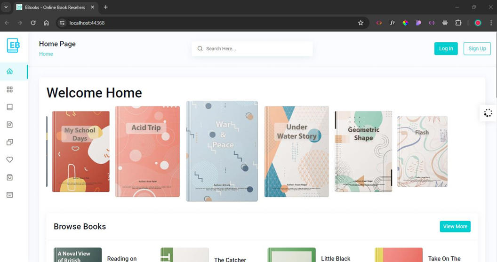

# E-Books Pvt Ltd. Online Bookresellar Application

## Project Overview

E-Books Pvt Ltd. is a leading used book retailer, offering a vast collection of local and foreign used books. To expand their business and enhance customer experience, they have developed an online web application with a range of functionalities for both customers and administrators.

  

## Features

### Customer Features
- **Registration**: New customers can register their details.
- **Order Books**: Only logged-in customers can place orders for books.
- **Manage Orders**: Logged-in customers can view and delete their orders.
- **Search Books**: All users can search for book details.
- **Feedback**: Logged-in customers can provide feedback on books.

  

### Admin Features
- **Register/Login**: Admins can register and log in to manage the system.
- **Manage Books**: Admins can add, update, and delete book details.
- **Manage Customers**: Admins can view and manage customer information.
- **Manage Orders**: Admins can handle all customer orders.
- **Generate Reports**: Admins can generate various reports related to books, orders, and customers.
- **Admin Dashboard**: Provides an overview of key metrics and system status.

  

## Technologies Used

- **Language**: C#, JavaScript
- **Framework**: ASP.NET
- **Database**: Microsoft SQL Server
- **IDE**: Visual Studio

## Getting Started

1. Clone the repository: `git clone https://github.com/Nava-stack/EBooksWebApplication.git`
2. Open the project in Visual Studio.
3. Set up the database by running the provided SQL scripts in Microsoft SQL Server.
4. Configure the database connection string in `appsettings.json`.
5. Build and run the application using Visual Studio.

## License

This project is licensed under the MIT License - see the [LICENSE](LICENSE) file for details.
